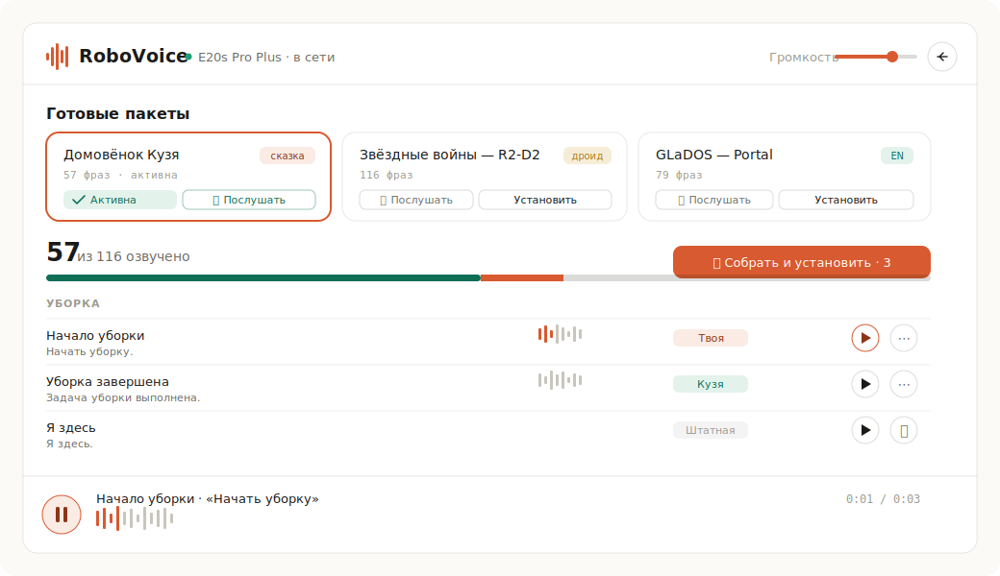

<div align="center">

# 🔊 RoboVoice

### Change your robot vacuum's voice from a clean web UI — no root, no paywall, no cloud lock‑in.

Give your **Trouver / Dreame / Mova** robot the voice of Кузя, R2‑D2, GLaDOS, Rick & Morty — or **record your own** and hear the robot say it.

**English** · [Русский](README.ru.md)



</div>

---

## Why this exists

Robot vacuums ship with a fixed set of voices, and the popular way to change them is a **closed, account‑gated web service**. RoboVoice is the open alternative:

- 🖥️ **A real web UI**, not a folder of `.tar.gz` files — preview every line, swap whole packs, build your own.
- 🔓 **Self‑hosted & free** — runs on your machine, talks to the vacuum cloud directly, **never stores your password** (only an in‑memory token for the session).
- 🎙️ **Make your own voice** — type text (TTS), record from the mic, or drop in any audio/video clip.
- 📚 **17 ready packs included** and a one‑command way to convert almost any community pack to your model.

> ⚠️ **Disclaimer.** This is a hobby/educational tool. Bundled character packs are community‑made and may contain copyrighted audio — they're included for personal use. If you own rights to any clip and want it removed, open an issue and it's gone. See [docs/CREDITS.md](docs/CREDITS.md).

---

## ✨ Features

| | |
|---|---|
| 🎧 **Audition before installing** | Play a montage of any pack's signature lines without touching the robot. |
| 🗂️ **Plain‑language dictionary** | Every event shown by meaning ("Start cleaning", "Low battery") — never raw file numbers. |
| 🎚️ **Live volume & activate** | Slider writes straight to the robot; switch packs instantly. |
| 🔁 **Honest install progress** | Real download %‑progress from the robot, auto‑retry on a dropped transfer. |
| ✍️ **Build your own pack** | Text‑to‑speech, mic recording, or file/video upload → builds + hosts + installs. |
| 🌍 **Multi‑brand / multi‑region** | Trouver, Dreame, Mova × RU / EU / US / SG. |

---

## 🚀 Quick start

```bash
git clone https://github.com/SashaEee/Trouver_audio_install.git
cd Trouver_audio_install
./run.sh           # installs deps into a venv and starts the server
```

Open **http://127.0.0.1:8765**, pick your app + region, log in with your robot account, and you're in.

<details>
<summary>Docker</summary>

```bash
docker compose up
```
</details>

**Requirements:** Python 3.10+, `ffmpeg` (for building custom packs), and a robot account (Trouver / Dreamehome / Mova).

---

## 📦 Included packs

| Pack | Style | Coverage |
|---|---|---|
| Домовёнок Кузя ×2 | 🧙 fairy‑tale | 57–70 |
| Советские фильмы | 🎬 movie quotes | 94 |
| Кузя + Винни + Остров | 📦 bundle | 94 |
| Дерзкая Галя · Супер ботаник | 😎 18+ | 57–81 |
| Звёздные войны (R2‑D2) | 🤖 droid | **116** |
| GLaDOS (Portal) | 🧪 EN | 79 |
| Rick & Morty · Eleonora · Dobkin · Warcraft · Alice | 🎙️ misc | 13–34 |
| Максим | 🔞 18+ | 65 |

…plus the stock RU / EN voices, which install instantly from the manufacturer CDN.

---

## 🧠 How it works

The robot expects a very specific format (MP3 16 kHz mono, files `./NNN.mp3` in a flat gzip‑tar), and **its event numbering differs from the community standard**. RoboVoice bridges them:

1. A **meaning bridge** maps your model's events → the canonical Dreame/Valetudo numbering.
2. **Per‑format converters** handle the 4 common community pack layouts (Valetudo‑ogg, mihome "tens", `event_variant`, named files).
3. Packs are rebuilt onto the official base, hosted, and installed via the cloud `set_property` MiOT call with honest progress.

Full write‑up: **[docs/HOW_IT_WORKS.md](docs/HOW_IT_WORKS.md)** · Add your own pack: **[docs/ADD_YOUR_PACK.md](docs/ADD_YOUR_PACK.md)**

---

## 🤝 Contributing

Packs, model mappings, and brand support are very welcome — see [CONTRIBUTING.md](CONTRIBUTING.md). Got a pack that voices more events on your model? PR the mapping.

## 🔐 Security & privacy

Your account password is used **once** to obtain a session token and is **never written to disk**. Tokens live in server memory and are dropped on logout. The tool talks only to the official vacuum cloud.

## 📄 License

Code: [MIT](LICENSE). Bundled audio belongs to its respective creators — see [docs/CREDITS.md](docs/CREDITS.md).

<div align="center">

**If this saved you from a paywall, drop a ⭐ — it genuinely helps others find it.**

</div>
