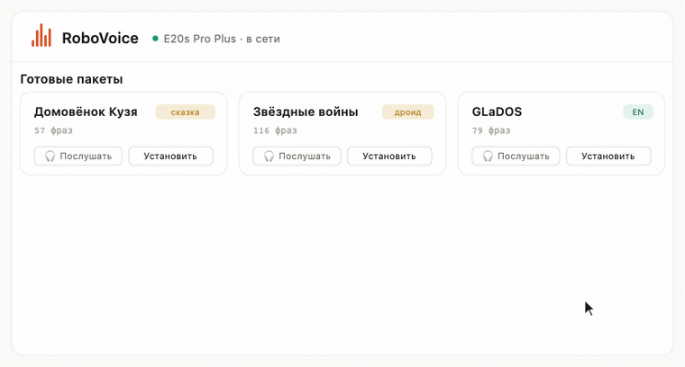

<div align="center">

# 🔊 RoboVoice

### Меняй голос робота-пылесоса из браузера — без рута, без платы, без привязки к чужому облаку.

Озвучь свой **Trouver / Dreame / Mova** голосом Кузи, R2‑D2, GLaDOS, Рика и Морти — или **запиши свой** и услышь его на роботе.

[English](README.md) · **Русский**



</div>

---

## Зачем это

У роботов-пылесосов зашит фиксированный набор голосов, а популярный способ их сменить — **закрытый сервис с привязкой к аккаунту**. RoboVoice — открытая альтернатива:

- 🖥️ **Нормальный веб‑интерфейс**, а не папка с `.tar.gz` — слушай каждую фразу, меняй паки целиком, делай свои.
- 🔓 **Self‑hosted и бесплатно** — крутится у тебя, ходит в облако пылесоса напрямую, **пароль не сохраняется** (только токен сессии в памяти).
- 🎙️ **Свой голос** — набери текст (синтез речи), запиши с микрофона или закинь любой аудио/видео‑фрагмент.
- 📚 **17 готовых паков в комплекте** и команда, чтобы переложить почти любой community‑пак на твою модель.

> ⚠️ **Дисклеймер.** Это хобби/образовательный проект. Готовые персонажные паки сделаны сообществом и могут содержать защищённое авторским правом аудио — они включены для личного использования. Если ты правообладатель и хочешь убрать фрагмент — открой issue, удалю. См. [docs/CREDITS.md](docs/CREDITS.md).

---

## ✨ Возможности

| | |
|---|---|
| 🎧 **Прослушать до установки** | Проигрывает фирменные фразы пака, не трогая робота. |
| 🗂️ **Словарь по‑человечески** | Каждое событие — по смыслу («Начало уборки», «Низкий заряд»), а не голые номера файлов. |
| 🎚️ **Громкость и включение вживую** | Ползунок пишет прямо на робот; паки переключаются мгновенно. |
| 🔁 **Честный прогресс установки** | Реальные проценты загрузки с робота, авто‑повтор при обрыве. |
| ✍️ **Свой пак** | Загрузите клипы и **перетащите их на фразы робота** (или тап‑в‑тап / по порядку), плюс текст‑в‑речь и запись с микрофона → сборка, хостинг и установка. |
| 🌍 **Мультибренд / мультирегион** | Trouver, Dreame, Mova × RU / EU / US / SG. |

---

## 🚀 Быстрый старт

```bash
git clone https://github.com/SashaEee/Trouver_audio_install.git
cd Trouver_audio_install
./run.sh           # поставит зависимости в venv и запустит сервер
```

Открой **http://127.0.0.1:8765**, выбери приложение и регион, войди под аккаунтом робота — и всё.

**Нужно:** Python 3.10+, `ffmpeg` (для сборки своих паков) и аккаунт робота (Trouver / Dreamehome / Mova).

---

## 📦 Готовые паки

| Пак | Стиль | Покрытие |
|---|---|---|
| Домовёнок Кузя ×2 | 🧙 сказка | 57–70 |
| Советские фильмы | 🎬 цитаты из кино | 94 |
| Кузя + Винни + Остров | 📦 сборник | 94 |
| Дерзкая Галя · Супер ботаник | 😎 18+ | 57–81 |
| Звёздные войны (R2‑D2) | 🤖 дроид | **116** |
| GLaDOS (Portal) | 🧪 EN | 79 |
| Рик и Морти · Элеонора · Добкин · Warcraft · Алиса | 🎙️ разное | 13–34 |
| Максим | 🔞 18+ | 65 |

…плюс штатные RU / EN, которые ставятся мгновенно с CDN производителя.

---

## 🧠 Как это устроено

Робот ждёт строго определённый формат (MP3 16 кГц моно, файлы `./NNN.mp3` в плоском gzip‑tar), и **его нумерация событий отличается от community‑стандарта**. RoboVoice их сшивает:

1. **Смысловой мост** сопоставляет события твоей модели → канонической нумерации Dreame/Valetudo.
2. **Конвертеры под форматы** разбирают 4 распространённых раскладки community‑паков (Valetudo‑ogg, mihome «десятки», `событие_вариант`, именованные файлы).
3. Паки пересобираются поверх официальной базы, хостятся и ставятся облачным вызовом `set_property` (MiOT) с честным прогрессом.

Подробно: **[docs/HOW_IT_WORKS.md](docs/HOW_IT_WORKS.md)** · Добавить свой пак: **[docs/ADD_YOUR_PACK.md](docs/ADD_YOUR_PACK.md)**

---

## 🔐 Приватность

Пароль аккаунта используется **один раз** для получения токена и **не пишется на диск**. Токены живут в памяти сервера и удаляются при выходе. Инструмент общается только с официальным облаком пылесоса.

## 📄 Лицензия

Код: [MIT](LICENSE). Аудио принадлежит его авторам — см. [docs/CREDITS.md](docs/CREDITS.md).

<div align="center">

**Если проект сэкономил тебе нервы — поставь ⭐, это правда помогает другим его найти.**

</div>
